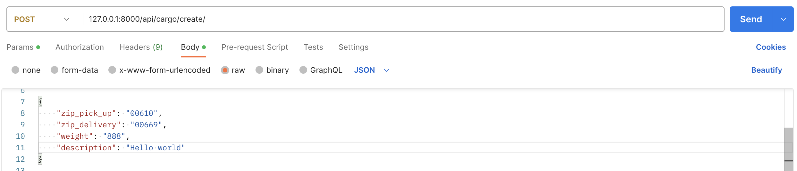
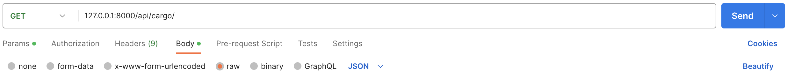
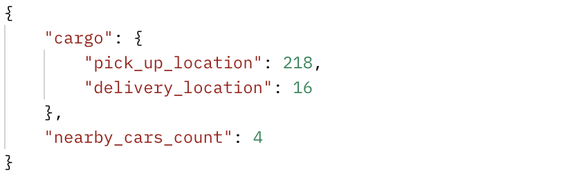
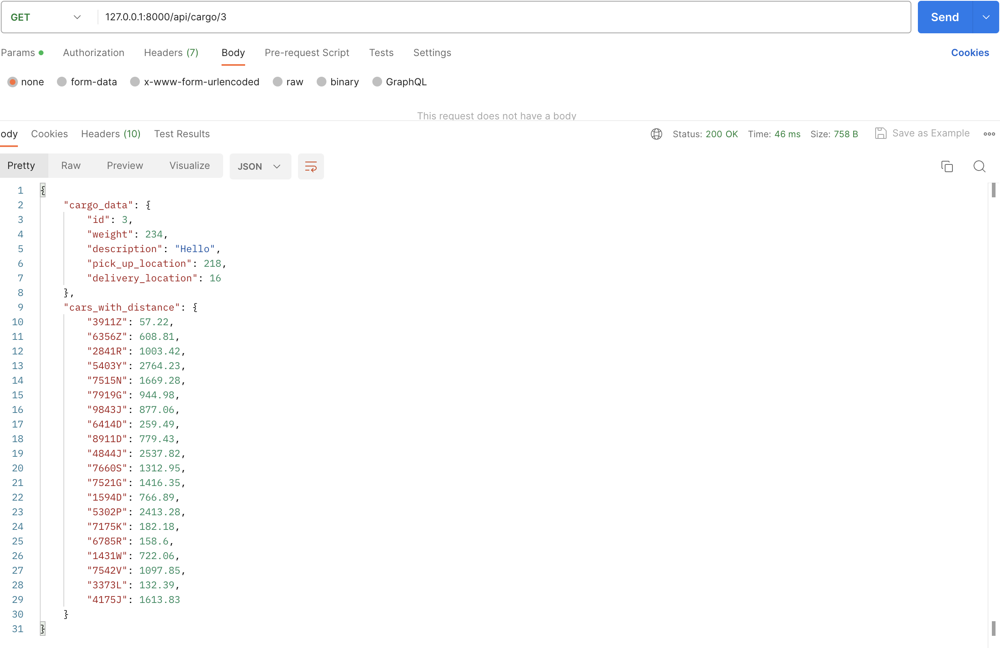
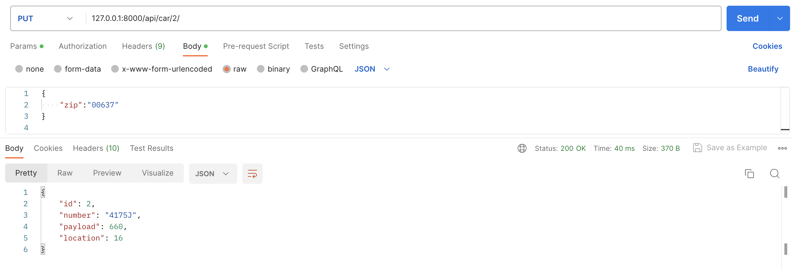
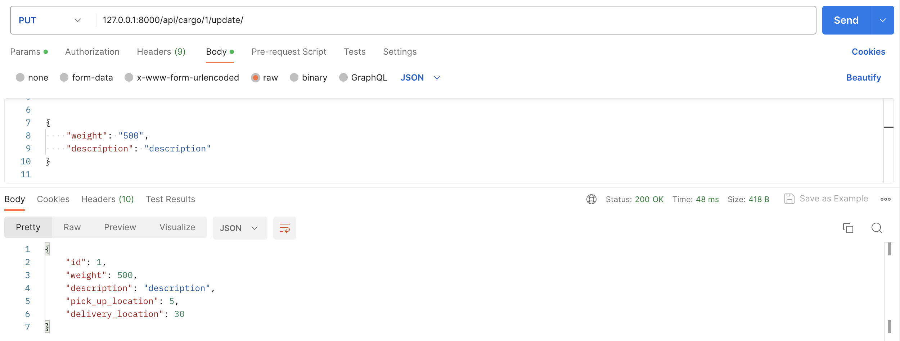
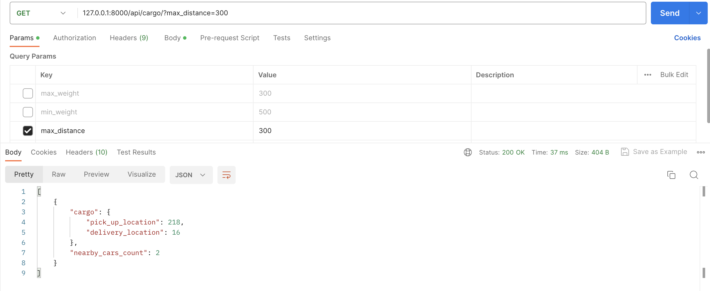

## #API: Сервис поиска ближайших машин для перевозки грузов.    Выполнен в рамках тестового задани на вакансию Web-программист Python

---

### Описание

    В проекте реализованы модели:
    - Cargo:
        pick_up_location - локация pick-up;
        delivery_location - локация delivery;
        weight - вес (1-1000);
        description - описание.

    - Car:
        number - уникальный номер (цифра от 1000 до 9999 + случайная заглавная буква английского алфавита в конце, пример: "1234A", "2534B", "9999Z")
        location - текущая локация;
        payload - грузоподъемность (1-1000).

    - Location:
        city - город;
        state - штат;
        zip - почтовый индекс (zip);
        latitude - широта;
        longitude - долгота.

* При сборке контейнеров проекта и запуске происходит запись в бд 20 уникальных машин с помошью кастомной команды create_cars;
* При сборке контейнеров проекта и запуске происходит выгрузка списка локаций из файла uszip.csv в базу данных;
* При создании машин по умолчанию локация каждой машины заполняется случайным образом;
* Расчет и отображение расстояния осуществляется в милях;
* Расчет расстояния осуществляется с помощью библиотеки geopy. Использовано расстояние от точки до точки.
    
<h5>Задание разделено на 2 уровня сложности. Выполнены оба уровня:</h5>
    
    Реализованы все базовые функции (описаны ниже)
    А так же:
        - Фильтр списка грузов (вес, мили ближайших машин до грузов);
        - Автоматическое обновление локаций всех машин раз в 3 минуты (локация меняется на другую случайную).

---

### Установка
    * Клонируйте репозиторий.
    * Сборка и запуск контейнеров: docker-compose up

P.S. Во время сборки будет создан superuser - username: admin , password: 123

---

### Использование
#### API endpoints:
### api/cargo/create/
    - Создание нового груза (характеристики локаций pick-up, delivery определяются по введенному zip-коду)
    
    Параметры запроса:
                    {
                        "zip_pick_up": "zip_code",
                        "zip_delivery": "zip_code",
                        "weight": "cargo_weight",
                        "description": "cargo_description"
                    }
        * zip_pick_up (zip_code) - zip-код начальной локации
        * zip_delivery (zip_code) - zip-код конечной локации
        * cargo_weight - вес груза
        * cargo_description - описание груза
<h7>Пример запроса в Postman:</h7>

~~ ~~ ~~ ~~ ~~
### api/cargo/
    - Получение списка грузов (локации pick-up, delivery, количество ближайших машин до груза ( =< 450 миль))

    *** По умолчанию происходит фильтрация машин по грузоподьемности так, чтобы они могли взять на борт выбранный вес
<h7>Пример запроса и ответа в Postman:</h7>

~~ ~~ ~~ ~~ ~~
### api/cargo/\<int:pk>/ 
    - Получение информации о конкретном грузе по ID (локации pick-up, delivery, вес, описание, список номеров ВСЕХ машин с расстоянием до выбранного груза)
<h7>Пример запроса и ответа в Postman:</h7>

~~ ~~ ~~ ~~ ~~
### api/car/\<int:pk>/ 
    - Редактирование машины по ID (локация (определяется по введенному zip-коду))
    
    Параметры запроса:
                    {
                        "zip":"new_zip"
                    }
        * new_zip - zip-код новой локации

<h7>Пример запроса и ответа в Postman:</h7>

~~ ~~ ~~ ~~ ~~
### api/cargo/\<int:pk>/update/ 
    - Редактирование груза по ID (вес, описание)
    
    Параметры запроса:
                        {
                            "weight": "new_weight",
                            "description": "new_description"
                        }
        * new_weight - новый вес груза
        * new_description - новое описание груза

<h7>Пример запроса и ответа в Postman:</h7>

~~ ~~ ~~ ~~ ~~
### api/cargo/\<int:pk>/delete 
    -Удаление груза по ID.
<h7>Пример запроса и ответа в Postman:</h7>

~~ ~~ ~~ ~~ ~~
### api/cargo/
    - Фильтр списка грузов (вес, мили ближайших машин до грузов)

    Параметры запроса:
        * max_weight - максимальный вес
        * min_weight - минимальный вес
        * max_distance - максимальная дистанция до машин (по умолчанию 450 миль)

    *** По умолчанию происходит фильтрация машин по грузоподьемности так, чтобы они могли взять на борт выбранный вес

<h7>Пример запроса и ответа в Postman:</h7>

---

    Дополенение, которое было реализовано не в рамках ТЗ уже было отмечено выше, но продублирую:
    при получении списка грузов с доступными для них авто 
    с точки зрения расстояния происходит фильтрация машин по грузоподьемности и их способности перевезти груз.

---
### Контакты:

